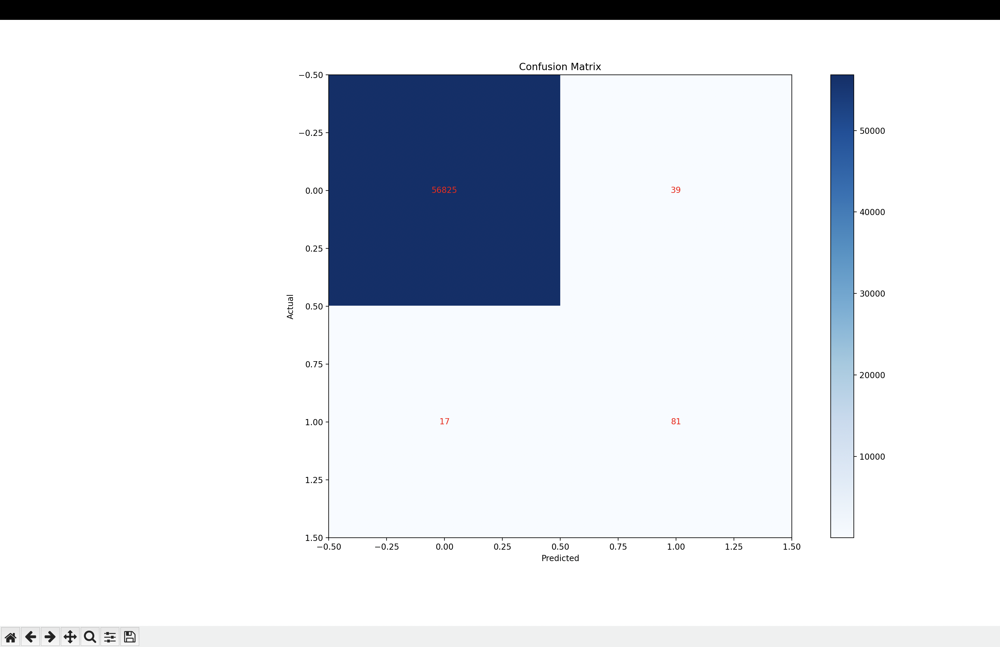
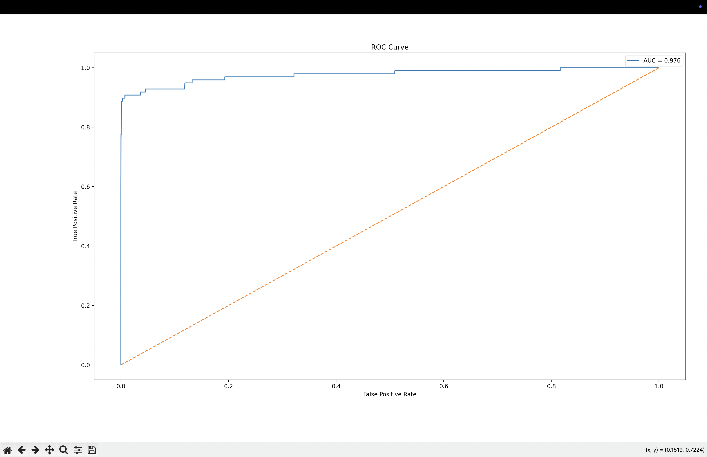

# 🛡️ Credit Card Fraud Detection — Machine Learning Project

This project builds a complete Machine Learning pipeline to detect fraudulent credit card transactions using a real-world dataset. It includes data preprocessing, oversampling, model training, evaluation, and visualization.

---

## 📌 Project Overview

Credit card fraud is rare (0.17% cases), making this an **imbalanced classification** problem.  
Because of this, **accuracy alone is meaningless**, so the project focuses on:

- **Recall** (ability to catch fraud)
- **Precision** (avoiding false alarms)
- **ROC-AUC** (overall discrimination ability)

---

## 🚀 Features Implemented

- Load and preprocess dataset  
- Scale `Time` and `Amount`  
- Handle imbalance using RandomOverSampler  
- Train Random Forest classifier  
- Evaluate with Accuracy, Precision, Recall, F1-score, ROC-AUC  
- Clean, industry-standard project structure  

---

## 📁 Project Structure

```
fraud-detection-ml/
│── data/
│── src/
│   ├── load_data.py
│   ├── preprocess.py
│   ├── train.py
│   ├── evaluate.py
│── run.py
│── requirements.txt
│── .gitignore
│── README.md
```

---

## 📊 Model Performance (Random Forest)

| Metric      | Score |
|-------------|--------|
| Accuracy    | 0.9992 |
| Precision   | 0.74   |
| Recall      | 0.83   |
| F1-Score    | 0.78   |
| ROC-AUC     | 0.918  |

---
---

## 📉 Confusion Matrix


## 📈 ROC Curve



## 🛠️ How to Run

```bash
pip install -r requirements.txt
python3 run.py
```

---

## 📦 Dataset

**Kaggle: Credit Card Fraud Detection**  
https://www.kaggle.com/datasets/mlg-ulb/creditcardfraud

---

## 🔮 Future Enhancements
 
- XGBoost & LightGBM models  
- Save best model (`best_model.pkl`)  
- FastAPI prediction endpoint  
- Streamlit dashboard  
- Cloud deployment  

---

## 👨‍💻 Author

**Pratyush Gupta**  
GitHub: https://github.com/rituGupta8898-cloud